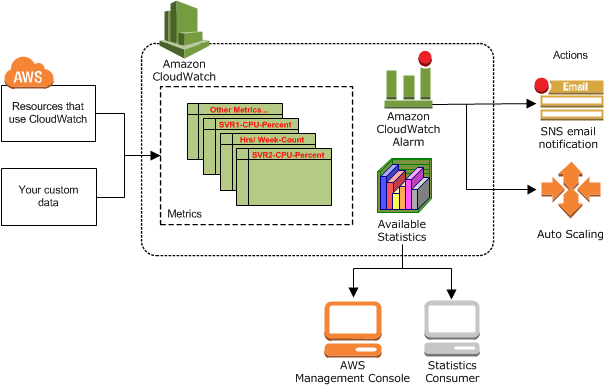
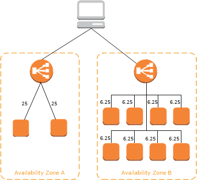

# Highly Available app

Highly available systems are reliable in the sense that they continue operating even when critical components fail. They are also resilient, meaning that they are able to simply handle failure without service disruption or data loss, and seamlessly recover from such failure.

A highly available application is one that can function properly when one or more of its components fail. It does not have a single point of failure, that is, when one component fails, the application can still deliver correct results.

### Diagram 1

AWS scalability with load balancing 

### Diagram 2 (mine):

### Concepts:

__Multi az - app deployed to 2 or more zones:__

Availabilty of our app -> Multi avalaiablaty zones, multi could environment. You can place instances in different AZs.

Each Region has multiple, isolated locations known as Availability Zones. When you launch an instance, you can select an Availability Zone or let us choose one for you. If you distribute your instances across multiple Availability Zones and one instance fails, you can design your application so that an instance in another Availability Zone can handle requests, so all the traffic will be redirected to the other machine in the other AZ.

Customers who care about the availability and performance of their applications want to deploy these applications across multiple AZs in the same region for fault tolerance and low latency. AZs are connected to each other with fast, private fiber-optic networking, enabling you to easily architect applications that automatically fail-over between AZs without interruption.

This ensures that customers avoid having a critical service dependency on a single data center. AWS can conduct maintenance activities without making any critical service temporarily unavailable to any customer.

__Monitoring - Cloud Watch:__

Have a look in the diagram.

_Cloudwatch: monitoring system available in AWS._

- How it works?: Resources that use Cloud Watch or your custom data.

What are the resources that we would like to monitor?: The instances. The entire infrastructure we will like to monitor it 24/7 attaching cloud watch.

Why do we need to it?: we want to monitor, to help the CPU, memory, etc. So help to check metrics. I would like to notify when the CPU is >= 75%, bring an alarm, using SNS -> send an email. So we know the problem, and then start to auto scaling to meet the demand, need to spin up the same servers and have the metrics statistics available again to monitor that, so it will notify to the person who is responsible and put that again on the interface (console, AWS Management Console). It costs money. In the instances, we have the tab `Monitoring`, where we have the metrics available. Then you create a status check and then fix the problem.

What is the benefit of monitoring the traffic?: Your monitor your expensives, so you don't lose your money. We manage costs. FOR THE BUSINESS.

Amazon CloudWatch is a monitoring and management service that provides data and actionable insights for AWS, hybrid, and on-premises applications and infrastructure resources. With CloudWatch, you can collect and access all your performance and operational data in form of logs and metrics from a single platform. This allows you to overcome the challenge of monitoring individual systems and applications in silos (server, network, database, etc.). CloudWatch enables you to monitor your complete stack (applications, infrastructure, and services) and leverage alarms, logs, and events data to take automated actions and reduce Mean Time to Resolution (MTTR). This frees up important resources and allows you to focus on building applications and business value.

You can use CloudWatch Container Insights to monitor, troubleshoot, and alarm on your containerized applications and microservices.

CloudWatch gives you actionable insights that help you optimize application performance, manage resource utilization, and understand system-wide operational health.

Amazon CloudWatch is basically a metrics repository. An AWS service—such as Amazon EC2—puts metrics into the repository, and you retrieve statistics based on those metrics. If you put your own custom metrics into the repository, you can retrieve statistics on these metrics as well.

You can use metrics to calculate statistics and then present the data graphically in the CloudWatch console.

You can configure alarm actions to stop, start, or terminate an Amazon EC2 instance when certain criteria are met. In addition, you can create alarms that initiate Amazon EC2 Auto Scaling and Amazon Simple Notification Service (Amazon SNS) actions on your behalf.

Monitors instance metrics. Monitoring system for AWS resources. For example, send notifications when load is at 70%.

AWS Cloud computing resources are housed in highly available data center facilities. To provide additional scalability and reliability, each data center facility is located in a specific geographical area, known as a Region.

__Load balancing - app load balancer, network load balancer, classic load balancer:__

Elastic Load Balancing (ELB) is a load-balancing service for Amazon Web Services (AWS) deployments. ELB automatically distributes incoming application traffic and scales resources to meet traffic demands. ELB helps an IT team adjust capacity according to incoming application and network traffic.

Balance traffic between the nodes of the architecture. You can launch several EC2 instances and distribute traffic between them.

Elastic Load Balancing automatically distributes incoming application traffic across multiple targets, such as Amazon EC2 instances, containers, IP addresses, Lambda functions, and virtual appliances. It can handle the varying load of your application traffic in a single Availability Zone or across multiple Availability Zones. Elastic Load Balancing offers four types of load balancers that all feature the high availability, automatic scaling, and robust security necessary to make your applications fault tolerant.

If one of these instances is experiencing heavy loads, traffic can be redirected to the others.

_The benefits:_

- Highly available: Elastic Load Balancing automatically distributes incoming traffic across multiple targets—Amazon EC2 instances, containers, IP addresses, and Lambda functions—in multiple AZs and ensures only healthy targets receive traffic. The Amazon Elastic Load Balancing Service Level Agreement commitment is 99.99% availability for a load balancer.

- Secure: Elastic Load Balancing works with Amazon VPC to provide robust security features, including integrated certificate management, user-authentication, and SSL/TLS decryption.

- Elastic: it is capable of handling rapid changes in network traffic patterns. Additionally, deep integration with Auto Scaling ensures sufficient application capacity to meet varying levels of application load without requiring manual intervention.

- Flexible: Elastic Load Balancing also allows you to use IP addresses to route requests to application targets. This offers you flexibility in how you virtualize your application targets, allowing you to host more applications on the same instance.

- Robust monitoring: it allows you to monitor your applications and their performance in real time with Amazon CloudWatch metrics, logging, and request tracing.

- Hybrid load balancing.

Who is using these services?: ELB helps an IT team adjust capacity according to incoming application and network traffic. So, any IT team that wants to have their application highly available to make sure their software is working properly.

_Elastic Load Balancing types:_

_- Application Load Balancer:_

Routes and load balances at the application layer (HTTP/HTTPS), and supports path-based routing. An Application Load Balancer can route requests to ports on one or more registered targets, such as EC2 instances, in your virtual private cloud (VPC). This increases the availability of your application. You add one or more listeners to your load balancer. A listener checks for connection requests from clients, using the protocol and port that you configure. 

With Application Load Balancers, the load balancer node that receives the request uses the following process:

1. Evaluates the listener rules in priority order to determine which rule to apply. 

2. Selects a target from the target group for the rule action, using the routing algorithm configured for the target group. The default routing algorithm is round robin. Routing is performed independently for each target group, even when a target is registered with multiple target groups. 

_- Network Load Balancer:_

Network Load Balancer operates at the connection level (Layer 4), routing connections to targets (Amazon EC2 instances, microservices, and containers) within Amazon VPC, based on IP protocol data. Ideal for load balancing of both TCP and UDP traffic, Network Load Balancer is capable of handling millions of requests per second while maintaining ultra-low latencies. Network Load Balancer is optimized to handle sudden and volatile traffic patterns while using a single static IP address per Availability Zone.

Routes and load balances at the transport layer (TCP/UDP Layer-4), based on address information extracted from the TCP packet header, not from packet content. Network Load Balancers can handle traffic bursts, retain the source IP of the client, and use a fixed IP for the life of the load balancer.

The load balancer node that receives the connection uses the following process:

1. Selects a target from the target group for the default rule using a flow hash algorithm. It bases the algorithm on:

    - The protocol
    - The source IP address and source port
    - The destination IP address and destination port
    - The TCP sequence number

2. Routes each individual TCP connection to a single target for the life of the connection. The TCP connections from a client have different source ports and sequence numbers, and can be routed to different targets. 

_- Classic Load Balancer:_

Classic Load Balancer provides basic load balancing across multiple Amazon EC2 instances and operates at both the request level and connection level. Classic Load Balancer is intended for applications that are built within the EC2-Classic network. We recommend Application Load Balancer for Layer 7 traffic and Network Load Balancer for Layer 4 traffic when using Virtual Private Cloud (VPC). 

It will balance the traffic between two differents AZ. To ensure that your registered instances are able to handle the request load in each Availability Zone, it is important to keep approximately the same number of instances in each Availability Zone registered with the load balancer. 

The load balancer node that receives the request selects a registered instance as follows: 

- Uses the round robin routing algorithm for TCP listeners.

- Uses the least outstanding requests routing algorithm for HTTP and HTTPS listeners.

_- Gateway Load Balancer:_

Distributes traffic to a fleet of appliance instances, providing scale, availability, and simplicity for third-party virtual appliances, such as firewalls, intrusion detection and prevention systems, and other appliances. Gateway Load Balancers work with virtual appliances that support the GENEVE protocol. Additional technical integration is required, so make sure that you consult the user guide before choosing a Gateway Load Balancer.

_Combination of ALB and NLB:_

__SNS (alarms 65/70%) Simple Notification Service:__

Amazon Simple Notification Service (Amazon SNS) is a fully managed messaging service for both application-to-application (A2A) and application-to-person (A2P) communication.

Amazon SNS leverages the proven AWS cloud to dynamically scale with your application. Amazon SNS is a fully managed service, taking care of the heavy lifting related to capacity planning, provisioning, monitoring, and patching. The service is designed to handle high-throughput, bursty traffic patterns and enables you to send millions of messages per second.

We want to make it even easier for developers to build highly functional and architecturally complex applications on AWS. It turns out that applications of this type can often benefit from a publish/subscribe messaging paradigm. In such a system, publishers and receivers of messages are decoupled and unaware of each other’s existence. The receivers (also known as subscribers) express interest in certain topics. The senders (publishers) can send a message to a topic. The message will then be immediately delivered or pushed to all of the subscribers to the topic.

Provices notificacions when an order is placed, or an instance is experiencing heavy load.

__Health checks CPU usage etc:__

Communicates with load balancer and auto scaling to manage the traffic flow and instance management. Monitor the status of instances and terminate and replace any deemed unhealthy.

Your Classic Load Balancer periodically sends requests to its registered instances to test their status. These tests are called health checks. The status of the instances that are healthy at the time of the health check is InService. The status of any instances that are unhealthy at the time of the health check is OutOfService. The load balancer performs health checks on all registered instances, whether the instance is in a healthy state or an unhealthy state. 

The load balancer checks the health of the registered instances using either the default health check configuration provided by Elastic Load Balancing or a health check configuration that you configure.

The health status of an Auto Scaling instance is either healthy or unhealthy. All instances in your Auto Scaling group start in the healthy state. Instances are assumed to be healthy unless Amazon EC2 Auto Scaling receives notification that they are unhealthy. This notification can come from one or more of the following sources: Amazon EC2, Elastic Load Balancing (ELB), or a custom health check.

After Amazon EC2 Auto Scaling marks an instance as unhealthy, it is scheduled for replacement. If you do not want instances to be replaced, you can suspend the health check process for any individual Auto Scaling group. 

__Route 53 DNS service:__

AWS service - traffic diversion. With route 53 we can reroute traffic from ireland to london if ireland is down.

A DNS that translates www.website.com to an IP (0.0.0.0/0).

It allows users to access the server through an address rather tan an IP.

Amazon Route 53 is a highly available and scalable cloud Domain Name System (DNS) web service. It is designed to give developers and businesses an extremely reliable and cost effective way to route end users to Internet applications by translating names like www.example.com into the numeric IP addresses like 192.0.2.1 that computers use to connect to each other.

Amazon Route 53 effectively connects user requests to infrastructure running in AWS – such as Amazon EC2 instances, Elastic Load Balancing load balancers, or Amazon S3 buckets – and can also be used to route users to infrastructure outside of AWS. You can use Amazon Route 53 to configure DNS health checks to route traffic to healthy endpoints or to independently monitor the health of your application and its endpoints. Amazon Route 53 Traffic Flow makes it easy for you to manage traffic globally through a variety of routing types.

Benefits:

- Highly available and reliable: Amazon Route 53 is built using AWS’s highly available and reliable infrastructure. The distributed nature of our DNS servers helps ensure a consistent ability to route your end users to your application.

- Flexible: Amazon Route 53 Traffic Flow routes traffic based on multiple criteria, such as endpoint health, geographic location, and latency.

- Simple: Amazon Route 53 can start to answer your DNS queries within minutes. You can configure your DNS settings with the AWS Management Console or our easy-to-use API.

- Scalable: Route 53 is designed to automatically scale to handle very large query volumes without any intervention from you.

Who is using these services?: A lot of companies like: airbnb, reddit, nubank, instacart, etc. Companies who want transfer DNS records for an existing domain or create records for a new domain. But 100 insurance companies that want to control their traffic, if for some reason one of their services in one region goes down, they can redirect this service to another region that has the same configuration.

_Route 53 with ELB:_

__Auto-scaling horizontal and vertical scaling:__

AWS Auto Scaling monitors your applications and automatically adjusts capacity to maintain steady, predictable performance at the lowest possible cost. Using AWS Auto Scaling, it’s easy to setup application scaling for multiple resources across multiple services in minutes.

Amazon EC2 Auto Scaling helps you ensure that you have the correct number of Amazon EC2 instances available to handle the load for your application. You create collections of EC2 instances, called Auto Scaling groups. You can specify the minimum number of instances in each Auto Scaling group, and Amazon EC2 Auto Scaling ensures that your group never goes below this size. You can specify the maximum number of instances in each Auto Scaling group, and Amazon EC2 Auto Scaling ensures that your group never goes above this size.

AWS resources, such as EC2 instances, are housed in highly available data centers. To provide additional scalability and reliability, these data centers are in different physical locations. Regions are large and widely dispersed geographic locations. Each Region contains multiple distinct locations, called Availability Zones, which are engineered to be isolated from failures in other Availability Zones.

Amazon EC2 Auto Scaling enables you to take advantage of the safety and reliability of geographic redundancy by spanning Auto Scaling groups across multiple Availability Zones within a Region. When one Availability Zone becomes unhealthy or unavailable, Auto Scaling launches new instances in an unaffected Availability Zone. When the unhealthy Availability Zone returns to a healthy state, Auto Scaling automatically redistributes the application instances evenly across all of the designated Availability Zones. An Auto Scaling group can contain EC2 instances in one or more Availability Zones within the same Region. However, Auto Scaling groups cannot span multiple Regions. For Auto Scaling groups in a VPC, the EC2 instances are launched in subnets. You select the subnets for your EC2 instances when you create or update the Auto Scaling group. You can select one or more subnets per Availability Zone.

Use auto-scaling to detect when loads increase, and then dynamically add more instances. Auto scaling group spins up nodes to meet a given capicity. Works accross multiple AZ.

Auto scaling spins up the instances based on the current demand to optimise performance.

AWS Auto Scaling lets you build scaling plans that automate how groups of different resources respond to changes in demand. You can optimize availability, costs, or a balance of both. AWS Auto Scaling automatically creates all of the scaling policies and sets targets for you based on your preference.

AWS Auto Scaling monitors your applications and automatically adjusts capacity to maintain steady, predictable performance at the lowest possible cost. Using AWS Auto Scaling, it’s easy to setup application scaling for multiple resources across multiple services in minutes.

- Benefits:

1. Setup scaling quickly: AWS Auto Scaling lets you set target utilization levels for multiple resources in a single, intuitive interface.

2. Make Smart Scaling Decisions: AWS Auto Scaling lets you build scaling plans that automate how groups of different resources respond to changes in demand. You can optimize availability, costs, or a balance of both. 

3. Automatically Maintain Performance: Using AWS Auto Scaling, you maintain optimal application performance and availability, even when workloads are periodic, unpredictable, or continuously changing.

4. Pay Only for What You Need: AWS Auto Scaling can help you optimize your utilization and cost efficiencies when consuming AWS services so you only pay for the resources you actually need. When demand drops, AWS Auto Scaling will automatically remove any excess resource capacity so you avoid overspending.

_- Auto Scaling with Load Balancing:_

To use Elastic Load Balancing with your Auto Scaling group, you attach the load balancer to your Auto Scaling group to register the group with the load balancer. Your load balancer acts as a single point of contact for all incoming web traffic to your Auto Scaling group.

When you use Elastic Load Balancing with your Auto Scaling group, it's not necessary to register individual EC2 instances with the load balancer. Instances that are launched by your Auto Scaling group are automatically registered with the load balancer. Likewise, instances that are terminated by your Auto Scaling group are automatically deregistered from the load balancer.

After attaching a load balancer to your Auto Scaling group, you can configure your Auto Scaling group to use Elastic Load Balancing metrics such as the Application Load Balancer request count per target (or other metrics) to scale the number of instances in the group as the demand on your instances changes.

You can also optionally enable Amazon EC2 Auto Scaling to replace instances in your Auto Scaling group based on health checks provided by Elastic Load Balancing. Otherwise, you can create a CloudWatch alarm that notifies you if the healthy host count of the target group is lower than allowed.

Amazon EC2 Auto Scaling can determine the health status of an instance using one or more of the following:

- Status checks provided by Amazon EC2 to identify hardware and software issues that may impair an instance. 

- Your custom health checks.

Who is using these services?: You should use AWS Auto Scaling to manage scaling for multiple resources across multiple services. Companies that want to ensure that they have the correct number of Amazon EC2 instances available to handle the load for their application.

_Types of auto-scaling:_

_- Scaling up/Vertical Scaling_

Increasing the size of instance (RAM, CPU, etc.). Scaling up is when you change the instance types within your Auto Scaling Group to a higher type (for example: changing an instance from a m4.large to a m4.xlarge).

_- Scaling out/Horizontal Scaling:_ 

Add more instances (replication). Scaling out is when you add more instances to your Auto Scaling Group and scaling in is when you reduce the number of instances in your Auto Scaling Group. Create more instances, replication, the same, to redirect the traffic.

Difference?:

When you scale out, you distribute your load and risk which in turn provides a more resilient solution.

When you scale up, you already invested money into buying larger servers and when less people are using it, it still costs the same for doing nothing. When you scale out, you are increasing the number of servers (with same configurations) to fit the current load. When there are less users, you can terminate the servers that are no longer needed, so you will save money, you will adapt your money according to needs without wasting it.

Scale-up does not suit a long-term strategy since the capacity of the servers will be upgraded to the threshold of their performance. The scale-out approach allows you to scale the architecture in the long-term. 

_Questions:_

1. What is our job role?: Make sure the app is running all the time.

2. How can we find out if something goes bad?: Monitoring (Cloud Watch).

3. How to make application highly available: deploying into multiple AZs, multi-cloud environment (next step) [trending clouds: aws, azure, gcp, etc]. When one is down, the traffic will go redirected to the other.

4. But who do this work?: Load balancer.

5. Reason why we might use multi cloud is because one of the cloud providers might have a failure.

6. What's the difference between scaling up and scaling out?:
Scaling up - increasing the size of the existing servers.  E.g. changing from t2.micro to t2.medium
Scaling out - spinning up more servers with the same configurations. E.g. same security groups, AMIs.
Scaling out is more beneficial. Benefit of that is costs savings.

7. Router 53?: it will check what servers are working, or what region have more traffic to check if we will need to change the region. And then the load balancer will check inside the regions.

If we introduce new technology, the cto will ask:

- How much will it cost.
- When will i get my money back/how long will it take.
- What are the benefits.
- Security.
- We can let they know all the details regarding real scenarios, incidents, to see the benefits.

DEFINITELY IS BENEFIT OF THE BUSINESS -> SAVING MONEY.

The three main constraints are:

- Cost.
- Quality.
- Time.

A distributed denial-of-service (DDoS) attack is a malicious attempt to disrupt the normal traffic of a targeted server, service or network by overwhelming the target or its surrounding infrastructure with a flood of Internet traffic -> we need to make sure that everything is safe.

Scaling:

- Scaling up is better for applications in which you don't expect a big spike in usage.

- Scaling out is better for applications with sudden usage spikes.

- Vertical Scaling - increasing the size of instance (RAM, CPU, etc.).

- Horizontal Scaling - add more instances (replication).

WE HAVE TO MAKE SURE THAT THE APP IS RUNNING -> CUSTOMER SATISFACTION.

[Link](https://github.com/alfonso-torres/eng84_Terraform) to implement the creation of auto scaling groups and application load balancer with terraform as well as create VPCs, subnets, security groups and start the application.
